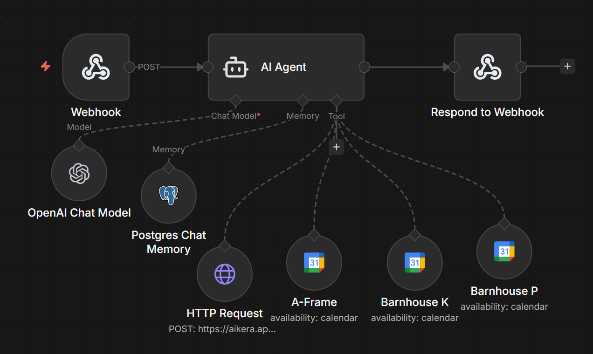
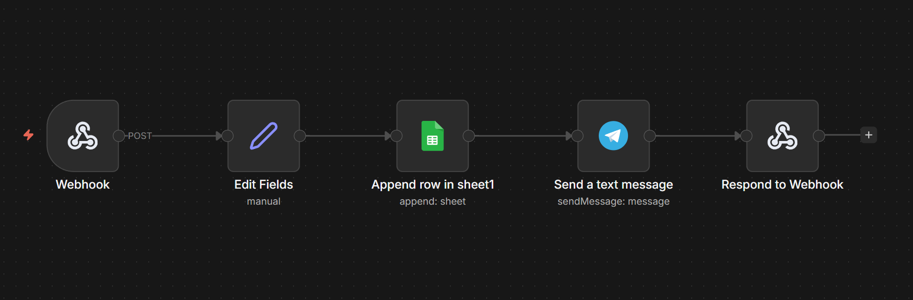
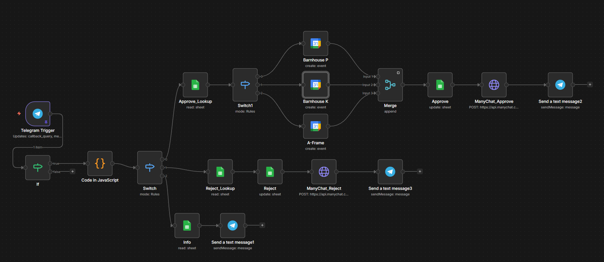

# AI Booking Automation System (n8n)

## Overview

This project demonstrates a production-style AI-powered booking automation system built with n8n. It combines an LLM-based booking agent, calendar availability tools, admin notifications, approval logic, and messaging integrations into a reusable template.

## Features

- AI-powered conversational booking intake
- Tool-based availability checks per property calendar
- Structured booking request logging in Google Sheets
- Telegram admin approval flow with inline actions
- Calendar event creation after approval
- User notification flow through ManyChat
- Template-ready architecture for reuse and customization

## Architecture

High-level flow:

User -> Intake Workflow -> AI Agent -> Calendar Check -> Admin Notification -> Admin Approval Panel -> Calendar Update + User Notification

## Workflows

### Intake Workflow

- Receives user input via webhook trigger
- Uses AI Agent with chat memory for context-aware dialogue
- Calls property-specific calendar tools to verify availability
- Collects required booking and payment-report data
- Escalates structured request to admin workflow only when conditions are met

### Admin Notification Workflow

- Receives structured booking request from intake workflow
- Logs booking details to Google Sheets
- Sends Telegram message with inline buttons (Approve / Reject / Details)

### Admin Approval Workflow

- Handles Telegram callback actions
- Routes approve / reject / details logic
- Updates booking status in Google Sheets
- Creates calendar events for approved requests
- Sends approval/rejection notification to user via ManyChat

## Screenshots

## Setup Instructions

1. Import all workflow JSON files into n8n.
2. Configure required credentials for OpenAI, Telegram, Google Sheets, Google Calendar, ManyChat, and Postgres.
3. Replace all placeholder values (IDs, tokens, webhook paths, chat IDs, flow IDs).
4. Connect Telegram, Google Sheets, Google Calendar, and ManyChat integrations.
5. Review the AI system prompt and update property/pricing rules for your business.
6. Test each workflow independently, then test end-to-end behavior.

## Customization

You can adapt this template by:

- Renaming properties and updating property-specific routing
- Replacing or extending calendar tools
- Updating admin notification message format and callback actions
- Revising booking rules, pricing logic, and payment policy
- Swapping integrations (for example, replacing ManyChat or Telegram)

## Repository Notes

- Sensitive values have been replaced with placeholders.
- Workflow screenshots are referenced for readability and portfolio presentation.
- This repository is intended as a public reusable template and portfolio project.

## Design Notes

The system separates conversational AI logic from irreversible operations (approval, calendar updates), improving reliability and control in real-world automation scenarios.
>>>>>>> d5185f0 (Initial commit)
